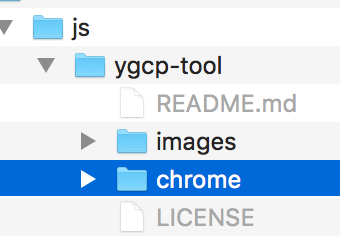
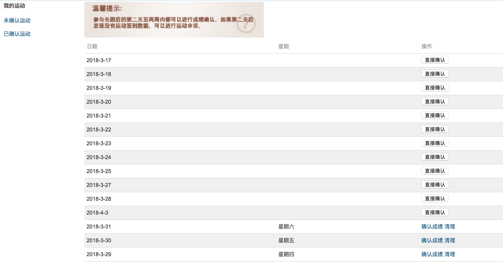

## 加载扩展

打开「开发者模式」，选择「加载已解压的扩展程序」

选中本项目中的 `chrome` 这个目录

只要一次有效且未确认的成绩，你就可以在未确认页面看到 「直接确认」 这个操作

## 原理

长跑系统并未校验你回传的日期

## 插件做了什么

遍历你未确认的列表，找到一个可以提交的成绩，然后遍历你所有的长跑，找到你没跑的那几天，然后在未确认的列表中插入那几天的确认操作

代码写的比较栏，能用就行：）

